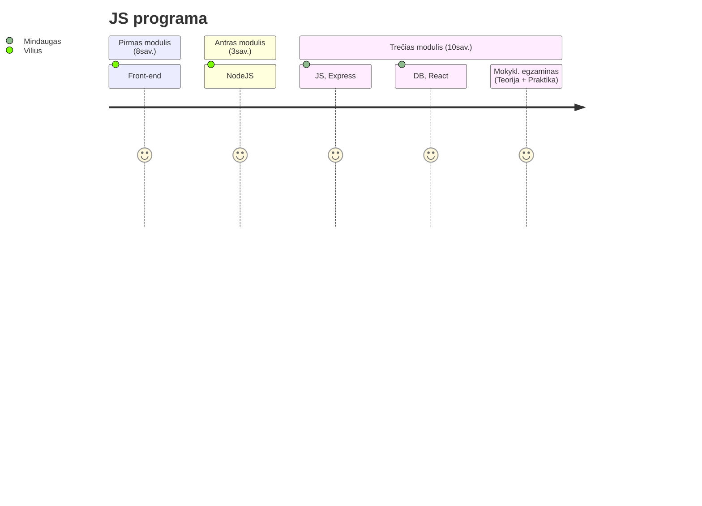
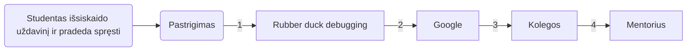

---
# try also 'default' to start simple
theme: default
# random image from a curated Unsplash collection by Anthony
# like them? see https://unsplash.com/collections/94734566/slidev
# background: https://source.unsplash.com/collection/94734566/1920x1080
# apply any windi css classes to the current slide
class: "text-center"
# https://sli.dev/custom/highlighters.html
highlighter: shiki
# show line numbers in code blocks
lineNumbers: false
# some information about the slides, markdown enabled
info: |
  ## Slidev Starter Template
  Presentation slides for developers.

  Learn more at [Sli.dev](https://sli.dev)
# persist drawings in exports and build
drawings:
  persist: false
# use UnoCSS
css: unocss
---

# JS 2023.01.09

Baltijos Technologijų Institutas

<!-- <div class="pt-12">
  <span @click="$slidev.nav.next" class="px-2 py-1 rounded cursor-pointer" hover="bg-white bg-opacity-10">
    Press Space for next page <carbon:arrow-right class="inline"/>
  </span>
</div> -->

<style>
h1 {
  background-color: #2B90B6;
  background-size: 100%;
  -webkit-background-clip: text;
  -moz-background-clip: text;
  -webkit-text-fill-color: transparent;
  -moz-text-fill-color: transparent;
}
</style>

<!--
The last comment block of each slide will be treated as slide notes. It will be visible and editable in Presenter Mode along with the slide. [Read more in the docs](https://sli.dev/guide/syntax.html#notes)
-->

---

## Programavimo mokykla

```js
while(not a programmer){
  learn
}
```

<div class="w-260 relative mt-6">
  <div class="relative w-100 h-40">
    
  </div>
</div>

<!-- vue script setup scripts can be directly used in markdown, and will only affects current page -->
<script setup lang="ts">
const final = {
  x: 0,
  y: 0,
  rotate: 0,
  scale: 1,
  transition: {
    type: 'spring',
    damping: 10,
    stiffness: 20,
    mass: 2
  }
}
</script>

<ul>
<span style="color: gold">~20%</span>
<li> Kiek valandų realaus darbo įdedama</li>
<li> Kokia asmenybė</li>
<li> Iš kokios srities atėjote/ Koks dabartinis žinių bagažas</li>
<li> Ar teisingai įsivaizduojame intern/junior poziciją/algas</li>
<li> Darbo paieškos </li>
</ul>

---

##

<div class="w-170 relative mt-6">
    
    <a href="https://survey.stackoverflow.co/2022/#experience-years-code">Šaltinis</a>
</div>

---

##

<div class="w-170 relative mt-6">
    
</div>

---

## Programa

<div class="grid grid-cols-3 gap-10 pt-4 -mb-6">



</div>
<ul style="font-size: 14px">
<li> <mdi-brain /> Testai/Įvertinimai/Sprintai - vyks visu šiuo periodu. </li>
<li> <mdi-book-open-blank-variant />  Mokyklinis egzaminas - birželio 8d. (dalyvavimas rekomenduotinas)</li>
<li> <mdi-school />  Oficialus egzaminas - mokamas (217,83 &euro;), vyksta egzaminų centro nustatytą dieną (įprastai apie 2-3sav. po studijų)</li>
</ul>

---

## Dėstytojai

 <div  grid="~ cols-4 gap-2" border="~ gray-400 opacity-50 rounded-md" style="margin: auto">
    
    
       
 </div>

---

## Mentoriai

  <div  grid="~ cols-3 gap-4" border="~ gray-400 opacity-50 rounded-md">
  <div style="text-align: center; font-weight:bold">
  
    <h4>Simona Zimkienė</h4>
       <span>I-V 09:00 - 15:00</span>
  </div>
  <div style="text-align: center; font-weight:bold">
 
    <h4>Vilius Ramulionis</h4>
       <span>I-V 08:00 - 17:00</span>
  </div>
    <div style="text-align: center; font-weight:bold">
  
    <h4>Deimantė Barauskaitė</h4>
    <span>I-IV 08:00 - 17:00</span>
  </div>
 </div>
<div  grid="~ cols-1 gap-4" border="~ gray-400 opacity-50 rounded-md" style="margin-top: 10px; width: 80%; display: inline-block">

</div>
<div  grid="~ cols-9 gap-4" style="margin-top: 5px; display: inline-block">


</div>


---

## Tvarkaraštis

|                                                                                                       |                                                                                                                    |
| ----------------------------------------------------------------------------------------------------- | ------------------------------------------------------------------------------------------------------------------ |
| <kbd>Pirmadienis</kbd> - <kbd>Ketvirtadienis</kbd> <br/><code>15:00 - 17:25 (10min. pertrauka)</code> | <div grid="~ cols-2 ">Teorija  </div>              |
| <kbd>Pirmadienis</kbd> - <kbd>Ketvirtadienis</kbd> <br/><code>10:25 - 15:00 (50min. pertrauka)</code> | <div grid="~ cols-2" > <b>Praktika</b>  </div> |
| <kbd>Penktadienis</kbd>                                                                               | Praktikos diena (Namų darbų atlikimas / Penktadienio pranešimai)                                                   |
| <kbd>Nedarbo dienos</kbd>                                                                             | Paskaitos nevyksta                                                                                                 |

---

## Praktika




---

## Penktadienio pranešimai

<ul>
<li>Papildomos paskaitos (Kompiuterių architektūra, NoSQL, testavimas ir t.t.)</li>
<li>IT įmonės/ekspertai</li>
<li>HR</li>
</ul>


---

## Lankomumas

Žymi dėstytojas. Pavėlavus į paskaitą, pranešti dėstytojui/mentoriui, kad pavėlavote. Su UŽT finansavimu studijuojantiems studentams:

<ul>
<li>
Už dienas kai nedalyvaujate paskaitoje, stipendija nebus mokama.
</li>
<li>
Praktikos metu svarbu būti pasiekiamam per Teams.
</li>
</ul>


---

## Klausimai?

---

## Google

Įpatingai dažnai naudojamas įrankis. Patarimai efektyvesniam googlinimui:

- 🧑‍💻 **[Programavimo kalba] [raktiniai žodžiai]** - užklausos pvz. JS event bubbling, CSS variables not working, JS random number, HTML input,...
- 🧑‍💻 **Errorus dėti į kabutes** - tuomet gausime tik pagal šią frazę atsakymus
- 🧑‍💻 **site:[puslapis]** - nurodome specifinį puslapį kuriame norime rasti atsakymą. Užklausos pvz. css variables not working site:stackoverflow.com
- 🧑‍💻 **-[frazė, kuri neturėtų būti užklausoje]** - užklausos pvz. how to write components in React -class
- 🧑‍💻 **before:[metai], after:[metai]** - užklausos pvz. React before:2019

<a href="https://www.freecodecamp.org/news/how-to-google-like-a-pro-10-tips-for-effective-googling/">Daugiau</a>


<br>

---

## Shortcuts

Laiko taupymui, greitesniam kodo rašymui:

- 🧑‍💻 **CTRL + S** - saugoti (save)
- 🧑‍💻 **CTRL + C** - kopijuoti (copy)
- 🧑‍💻 **CTRL + V** - įklijuoti (paste)
- 🧑‍💻 **CTRL + A** - pasirinkti viską (select all)
- 🧑‍💻 **CTRL + X** - iškirpti (cut)
- 🧑‍💻 **ALT + [pažymim su pelyte ką keisime]** - keisti reikšmes vienu metu keliose vietose
- 🧑‍💻 **ALT + [rodyklė į viršų] / ALT + [rodyklė žemyn]** - perkelia eilutę kodo į viršų arba į apačia
- 🧑‍💻 **CTRL + Z** - grįžti į ankstesnį pokytį (undo)\
- 🧑‍💻 **CTRL + F** - paieška faile
- 🧑‍💻 **CTRL + /** - užkomentuoja
- 🧑‍💻 **CTRL + L** - Pažymėti dabartinę eilutę
- 🧑‍💻 **CTRL + SHIFT + Z** - grįžti į vėlesnį pokytį (redo)

VScode shortcuts pdf'ai.

---

## VScode Extensions

<a href="https://vscodethemes.com/?type=dark">VS code temos</a>

---

## Kiti patarimai

- 📝 **Kalbame/skaitome/klausome kuo dažniau apie kodą**
- 📝 **Aktyviai bendrauti grupiokais**
- 📝 **Jei turime laisvo laiko, mokomės papildomai arba prašome papildomų užduočių**
- 📝 **Galite susigalvoti papildomą projektą, kuriam skirtume bent po truputi laiko kasdien**
- 📝 **Kursų eigoje tvarkomės CV, linkedin, github**
- 📝 **Dalyvaujame programavimo renginiuose**
- 📝 **Neperdegame ir stengiamės nepamesti savo tikslo**

---

## TEAMS


- Rašyti/skambinti asmeniškai/grupėje
- Mute/unmute
- Įrašai
- Share screen
- Reactions

\*Nuo asmeninės Teams paskyros (jei tokia yra) reiktų atsijungti ir naudotis tik ...@balticinstitute.onmicrosoft.com paskyra.

---

# SUSIPAŽINKIME 😊

<ol>
<li>Vardas?</li>
<li>Miestas?</li>
<li>Kodėl programavimas? Kodėl BIT?</li>
<li>Iš kokios srities atėjote?</li>
<li>Įdomus faktas apie tave?</li>
</ol>
